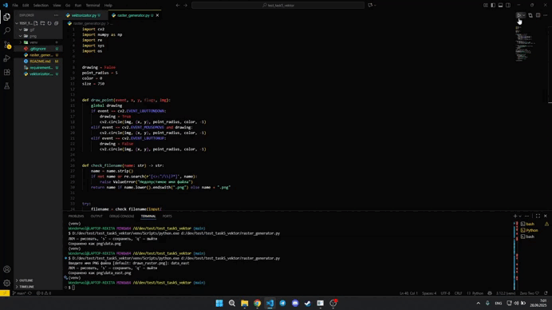

# Векторизатор растров

## Описание проекта
Программа для генерации бинарных PNG-изображений последующей векторизации их в формат SVG.  

Основные возможности:
- Создание бинарных растров в PNG.
- Векторизация PNG в SVG с использованием OpenCV.
- Отображение найденных контуров через matplotlib.
- Простая CLI-настройка параметров векторизации (ядро и количество итераций объединения точек).

## Технологии
- **Python 3**
- OpenCV — работа с изображениями.
- NumPy — математика.
- Matplotlib— визуализация.
- svgwrite — генерация SVG.

## GIF-демонстрация
  

## Установка и запуск

## 1. Клонируйте репозиторий:

git clone https://github.com/Wonderwol/test_task5_vektor.git

cd test_task5_vektor

## 2. Создайте и активируйте виртуальное окружение:

python -m venv venv

Windows

venv\Scripts\activate

macOS/Linux

source venv/bin/activate

## 3. Установите зависимости:

pip install -r requirements.txt

## Использование

## 1. Запустите модуль для рисования:

python drawer.py

## 2. Введите название файла:

## 3. Нарисуйте мышью и сохраните:

Сохранить - s (английская раскладка)

## 4. Запустите модуль для векторизации:

python vektorizator.py

## 5. В терминале укажите PNG-файл и выберите параметры векторизации (ядро и итерации).
